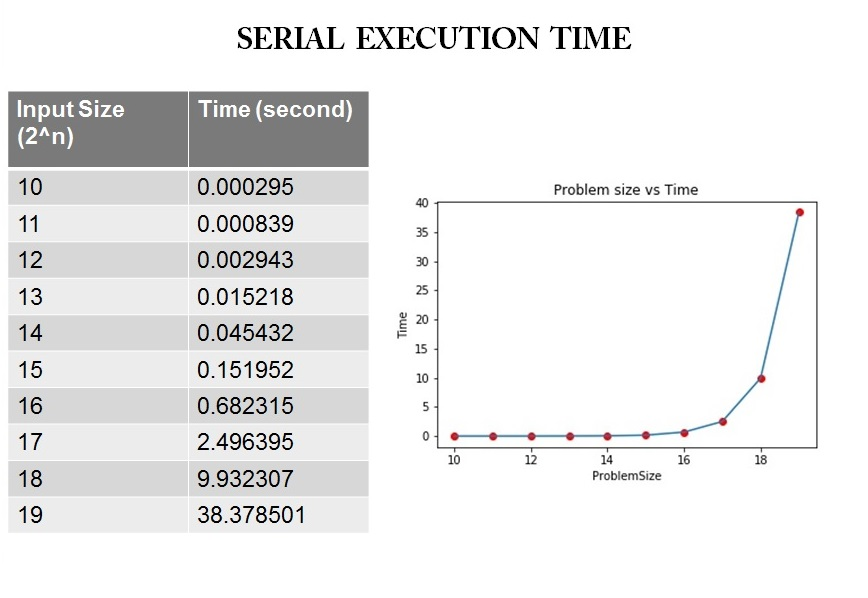
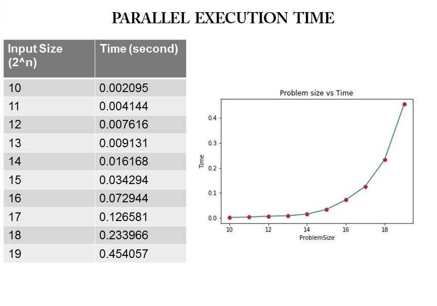
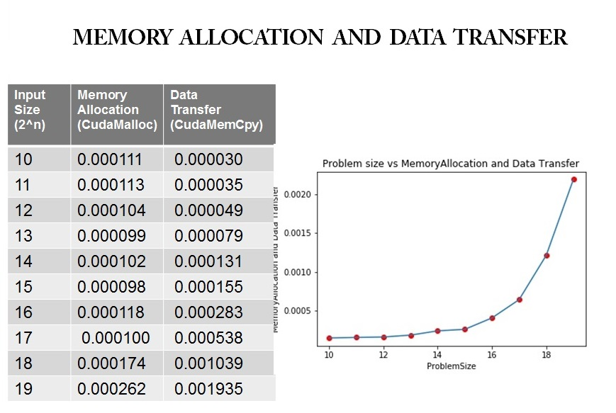
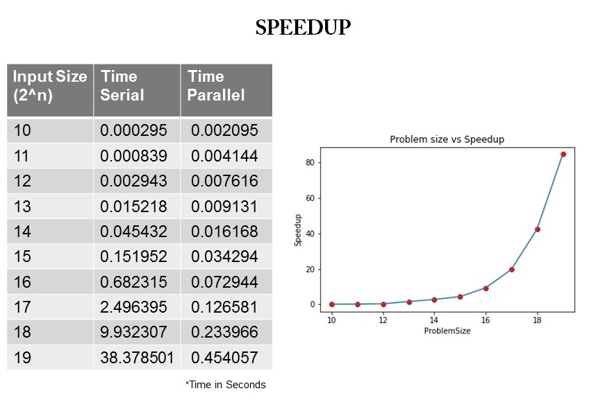

# QuickSort-Using-CUDA
Accelerated Computing • Parallel Programming

# What is Quicksort ? 
Quicksort is a Divide and Conquer algorithm. It picks an element as pivot and partitions the given array around the picked pivot.

# How Quicksort Works ?

**Pivot Selection** - Pick an element, called a pivot, from the array (usually the leftmost or the rightmost element of the partition).

**Partitioning**- Reorder the array so that all elements with values less than the pivot come before the pivot, while all elements with values greater than the pivot come after it (equal values can go either way).

**Recursion** - Recursively apply the above steps to the sub-array of elements with smaller values than pivot and separately to the sub-array of elements with greater values than pivot

# Challenges  Faced
1.Recursion Not Supported

2.Designing an Iterative Algorithm

3.Parallelization of Iterative Algorithm 

4.Address Management with Stack

5.Thread Synchronization to avoid multiple access of data.

6.Dynamic Allocation of Number of threads and blocks.

# Optimization  Strategy

The serial code is implemented by the help of the one stack, hence the performance of this algorithm will fall with increase in input size.
To optimize the strategy into parallel execution use of two stacks has been done in order to separately and parallely perform the execution of partition. 
Left and right partition will each have a stack of their own so we can run these both partitions parallely to achieve better computational time. 

